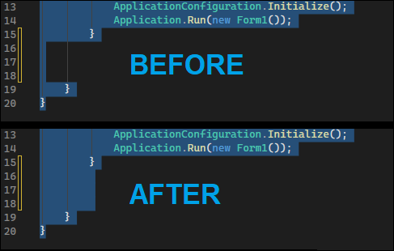

# Real Tab Indenter

A Visual Studio extension that inserts **real tab characters** on blank lines
inside indented C# blocks, instead of Visual Studio's default virtual indentation.

## The problem
When you press Enter inside an indented block, Visual Studio positions the cursor
visually at the correct indent level but writes no actual characters. The line
appears indented but is truly empty. Typing immediately after Enter can cause
the editor to fill the gap with mixed spaces and tabs.

## The fix
This extension hooks into the C# editor and automatically writes the correct
number of real `\t` characters to every new blank line, so what you see matches
what is actually in the file.

## Compatibility
Visual Studio 2022 and 2026.
